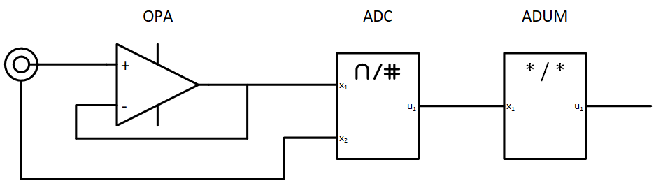

# R&D AnalogFrontend

Dieses Repository dient als Sammler für alle Notizen, Dokumentationen, Ergebnisse welche wärend der Entwicklung und Qualifikation analoger Messverstärker mit D/A-Wandler erstellt werden. Eingesetzt werden soll dieses analoge Frontend zum Anschluss von pH, Redox (ORP) u.Ä. Messelektroden.

# Design

# Anforderungen

* Eingangsimpedanz: > 5 GOhm
* Eingangsspannungsbereich: xxx

# Bauelementeauswahl

## Operationsverstärker
Um die geforderte Eingangsimpedanz (GOhm Bereich) zu erreichen kann vor dem ADC ein Operationsverstärker vorgesehen werden.

* AD8603

## Analogdigitalwandler
Digitalisierung und ggf. Vorverstärkung (PGA) des analogen Signals.

* ADS1115
* MCP3427

## Isolator
Galavanische Trennung von Messverstärker und -elektrode um Interferenzen zwischen verschiedenen Elektroden zu vermeiden.

* ADUM5401
